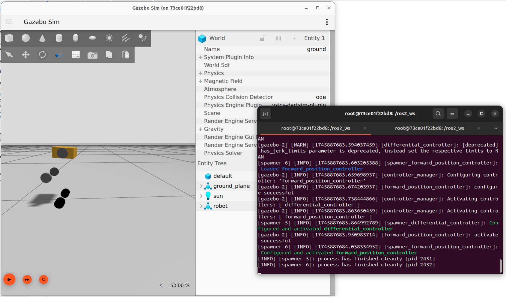

# Wheeled Biped Sim




### Build

```bash
docker build . -t wheeled_biped:jazzy
```


### Run

```bash
rocker --x11 \
    --device=/dev/kfd --device=/dev/dri --group-add video \
    --volume ${PWD}:/ros2_ws/src/:rw \
    --name wheeled_biped_docker \
    wheeled_biped:jazzy

colcon build --symlink-install
source install/setup.bash

ros2 launch wheeled_biped_description simulation.launch.py
```

```
ros2 topic pub --rate 10 /speed geometry_msgs/msg/TwistStamped "
twist:
  linear:
    x: 0.01
    y: 0.0
    z: 0.0
  angular:
    x: 0.0
    y: 0.0
    z: 0.1"

```
