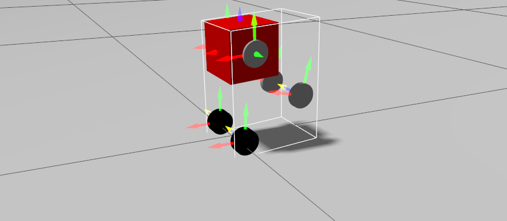

# Wheeled Biped Sim




### Run

```bash
rocker --x11 --user \
    --device=/dev/kfd --device=/dev/dri --group-add video \
    --volume ${PWD}:/workspace/:rw -- \
    ghcr.io/sloretz/ros:jazzy-simulation
    
cd /workspace
```
